Car rental — process of thought

Inspiration website I used as a guide: https://www.sixt.com/

# 01-Challenge

- First of all I created a project with npm create vite and selected React +
  TypeScript + SWC.
- I cleaned the boilerplate code and files, leaving only App.tsx and main.tsx.
- I created the interfaces, types and data folders. Inside interfaces I created
  Car.ts with the corresponding interface. Inside types I created CarTypes with
  several types related to cars that I used in the Car interface. Inside data I
  created cars.ts with all the mock data of the cars, using an array of type Car
  (the interface I created).
- I created the components folder in src with the components CarCard, which
  represents the card of each car, and CarList, which is the list of all the cars
  (no styles yet). Here I did a lot of studying of React and props, because some
  things weren't clear to me, like how to type props. I decided to pass car to
  CarCard as a whole object, since the object had many properties and I felt that
  destructuring it would make the code messy.
- I created the GitHub repo and made the first commit.
- Added Tailwind and applied styles.
- Created a UI folder to make a component called Badge, because I thought it was
  necessary since I was using the same code for the badges several times.
- Added images to public and used a conditional to render either the image of each
  car or a placeholder if it doesn't have one.
- Did the same thing with the button (created a component in UI) that I did with
  the Badge.
- Wrote the README.md and pushed the last changes to main.

Comments on how I felt about this challenge:

Starting the project by creating the interface and some types first was, I think,
a good decision, and I had no problem with that. When I had to start creating all
the components in React I got a bit stuck and had to review a lot of material.
What cost me the most was props: I didn't remember well how to handle them, and
also how to type them. I didn't understand the logic that when you pass a prop an
object is created, and that I can't type that object directly but instead have to
type the property or properties that are inside it. That took me a while to
understand. After that I could keep going without problems; rendering the list of
cars with map and one card per car wasn't much of a problem, I remembered that
beyond having to check the syntax a bit. Then I also created the Badge and Button
components, because I felt Badge was repeating a lot of code and the same would
happen with Button, and it also helped me practise children props a bit. I felt
very out of practice on some things that I know are basic, but I feel I pick the
rhythm back up quickly. By the way, I tried to do the styles myself but I relied
quite a bit on AI so as not to lose too much time there. I also used AI to
explain concepts I didn't understand well, like props, and to review my code and
point out my mistakes. It generated the mock car data and most of the Tailwind
classes. The component structure, the types and the decisions are mine.

### DECISION about CarList importing the mock cars directly:

It makes more sense for a purely presentational component like
CarList not to handle getting the data, and to receive it from its parent
instead, without knowing where it came from.

If the data comes from an API later, CarList would receive it the same way,
through the same prop, without changing anything inside it. The only thing
that changes is how App obtains the data.

I put that responsibility in App because it's the root of the application:
the place where everything is assembled. The components at the edges display,
the root knows where things come from.

There is a second benefit. If several components need the same data, doing the
import or the API call inside each one would mean repeating the same request in
several places, with the risk of them showing different things. Doing it once
at the top and passing it down as props keeps a single source of truth.

# 02-Challenge

Before starting challenge 2, I first reviewed useState and practised it with a
few exercises to get it fresh again. After that I spent a lot of time practising
how to capture inputs and use them with state (this is where I studied the most).

Now, how the challenge went:

I decided to start with the search bar, so I began by adding a text input with a
"Search" placeholder. I created the `search` state, where I'm going to store
whatever the user types in the search bar, capturing it in the input through an
`onChange` and saving the value with `setSearch` (the state I created). I tested
that it worked by creating a paragraph with the content of `search`, to see if
that paragraph changed with what I was typing in the search bar. For now I
didn't create a separate component for this search/filters section, I'll do that
once it works.

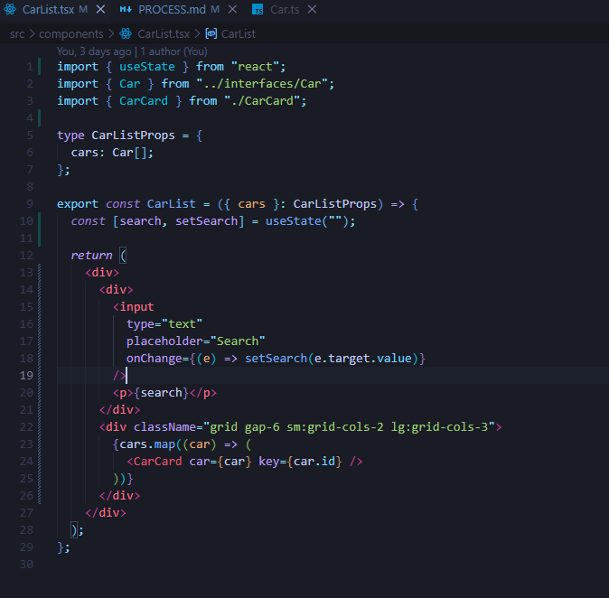

With what the user types now captured in state, I can filter the cars that are
displayed based on that state. But I already know I'm going to have more than one
filtering condition, so I decided to create a `filteredCars` constant, and inside
it several constants, one for each filtering condition. I started with
`searchFilter`, which is the one for the search bar and filters by whether the
car's brand or model contains what the user typed. I return `searchFilter`, which
for now is my only condition, and the map that renders one CarCard per car now
runs over `filteredCars` instead of `cars`.
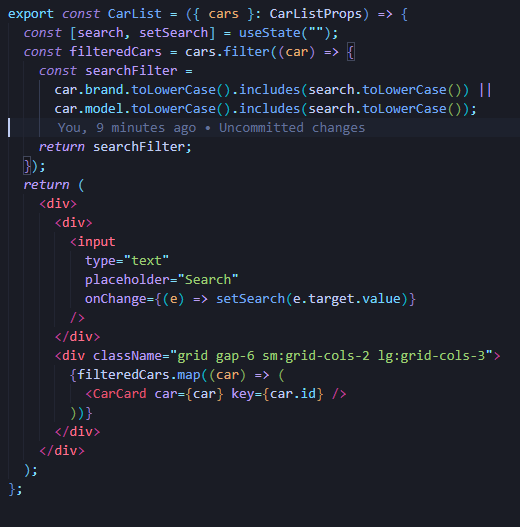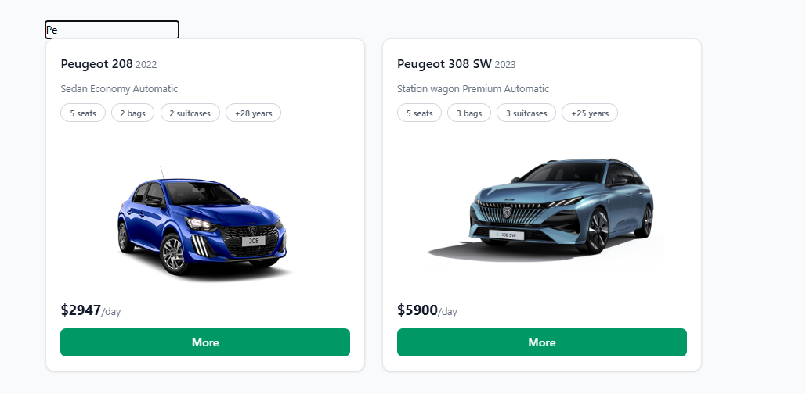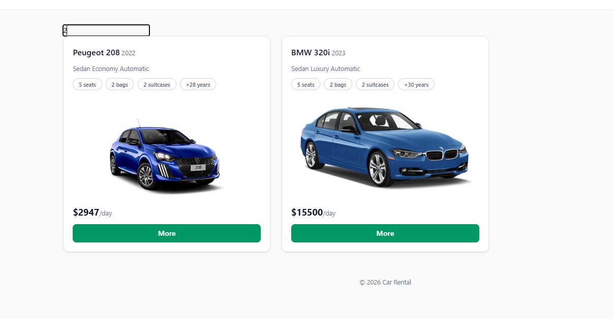

As the next filter I created a button that works as a toggle, so I can filter the
cars by whether they're automatic or not. So I created another state to hold
whether that button is true or false. Then, inside `filteredCars`, I created a new
constant `automaticFilter` where I filter each car by either of these options: if
the value of `onlyAutomatic` is false (`!onlyAutomatic`), or if the car is
automatic (`car.gearbox === "Automatic"`). I return that constant together with
`searchFilter`.
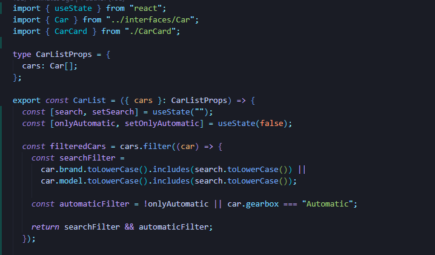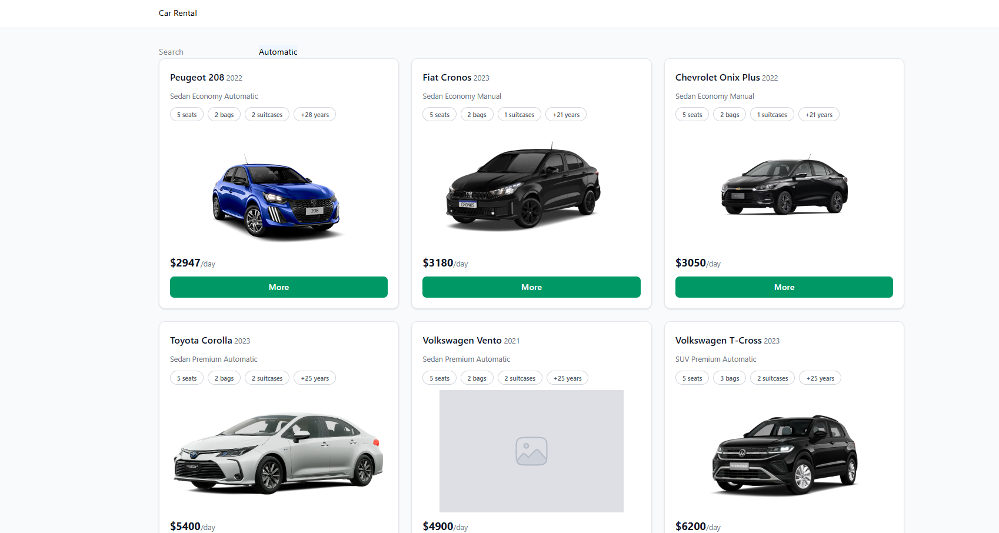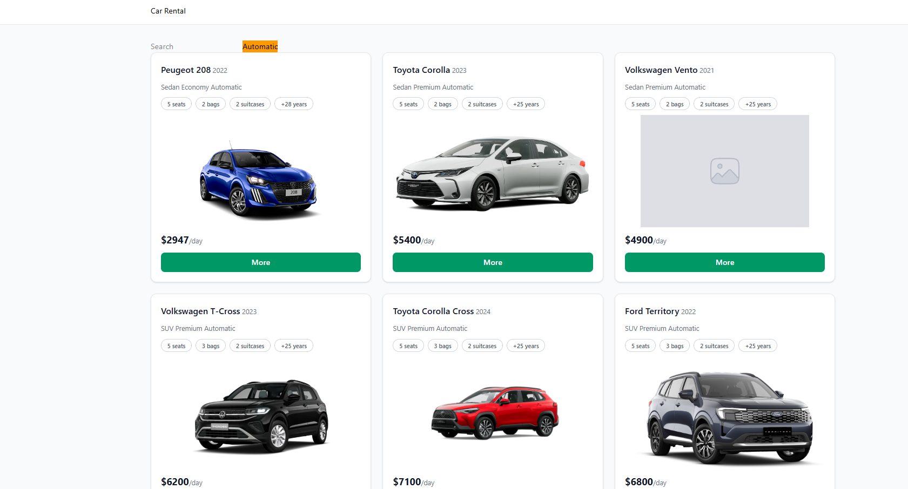

The next filter I created was the vehicle type one. I created a select with 5
options: one for all of them, and then one per car type. I created a state to
handle which filter is selected, which is "All" by default. Then I use that state
to filter car by car: if the state is "All" it lets every car through, otherwise
it checks whether the car's type is equal to the state of the select. I also
created a new type, which is `VehicleType` plus the "All" option added through a
union type, so I could type the select's state correctly.
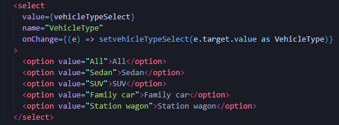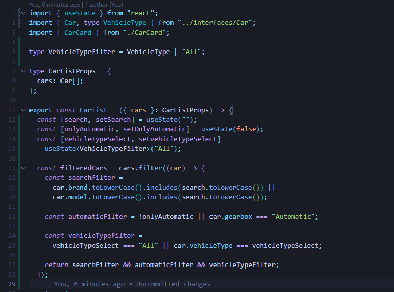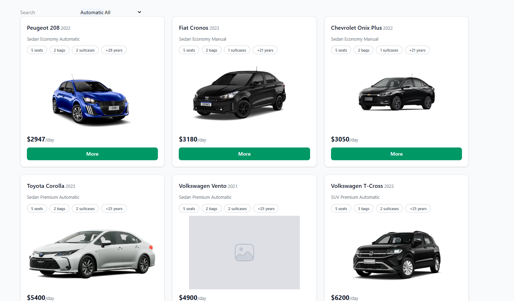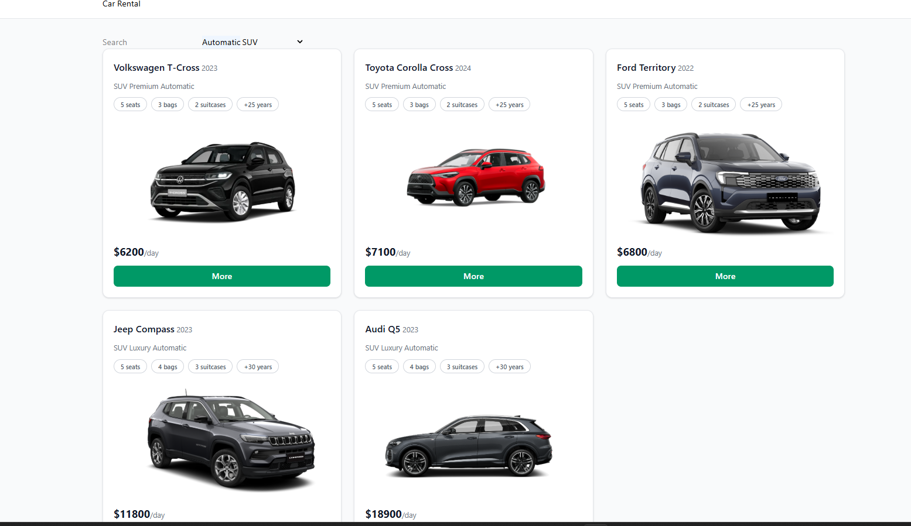

Then I did the same thing with the categories — luxury, economy, premium in a
select.
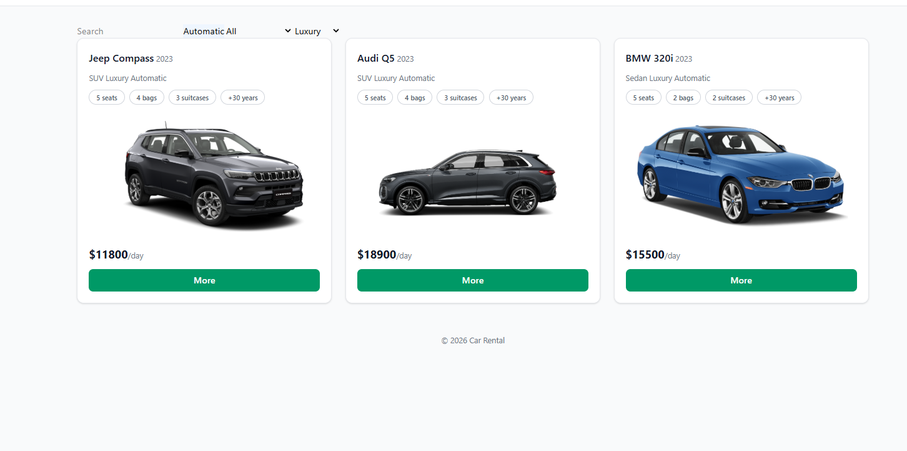

I added the conditional to render either the grid of cars or the message saying
none were found.
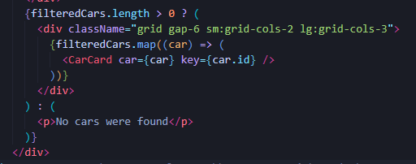

I created a `pages` folder with `CarsPage`, which owns the filter state and computes the filtered list, and a new `CarFilters` component with the controls.
The reason the state ended up in the page is structural. Once I pulled the controls out of `CarList` into their own component, `CarFilters` and `CarList`
became siblings, and both need the same values: the filters to display what the
user selected, and the list to show the result of filtering. In React data only
flows down, so two siblings can't share a value between them it has to live in
their closest common parent. That's the page.

Styles remaining.
